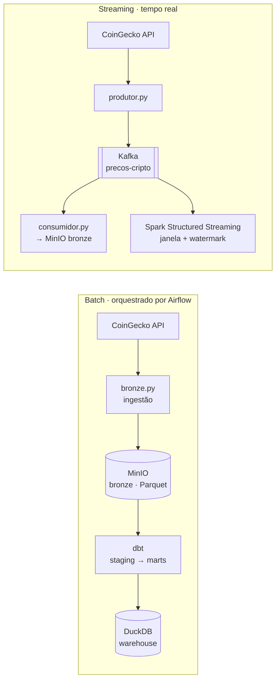

# CriptoFlow — Plataforma de Dados de Criptomoedas

Pipeline de dados **ponta a ponta** — do batch ao tempo real — construído do zero, alimentado pela API pública da CoinGecko. Stack 100% open-source, reproduzível com Docker.

`Python` · `SQL` · `Docker` · `MinIO (S3)` · `Airflow` · `dbt` · `DuckDB` · `Spark` · `Kafka`

---

## 📖 Sobre o projeto

**Pergunta de negócio:** *"Quero acompanhar, historicamente e em tempo real, o preço e o volume das principais criptomoedas, e servir esses dados de forma confiável para análise."*

O CriptoFlow responde a isso com uma plataforma em camadas, cobrindo os cinco estágios do ciclo de vida da engenharia de dados: **fonte → ingestão → armazenamento → transformação → consumo**, com orquestração, qualidade e streaming em volta.

---

## 🏗️ Arquitetura



O dado cru é guardado primeiro (**ELT**) e refinado em camadas **Medallion** (bronze → silver/gold). O batch é orquestrado pelo Airflow; a trilha de streaming transporta eventos via Kafka e os processa com Spark.

---

## 🧰 Stack (e por que cada ferramenta)

| Camada | Ferramenta | Por quê |
|---|---|---|
| Linguagem | Python + SQL | Iniciando com o ciclo básico. Muitos problemas são solucionados com ambas|
| Containers | Docker Compose | Ambiente reproduzível em qualquer máquina |
| Object storage | MinIO (compatível com S3) | Armazenar dado cru barato; espelha o S3 real |
| Formato | Apache Parquet | Colunar e comprimido — padrão em analytics |
| Orquestração | Apache Airflow | Dependências, retry, backfill, visibilidade |
| Transformação | dbt (dbt-duckdb) | SQL versionado, testado e com lineage |
| Warehouse analítico | DuckDB | Consulta Parquet do lake em altíssima velocidade |
| Processamento distribuído | Apache Spark (PySpark) | Processar volumes que não cabem numa máquina |
| Streaming | Apache Kafka (KRaft) | Transporte durável de eventos em tempo real |

---

## 📂 Estrutura do projeto

```
criptoflow/
├── docker-compose.yml        # postgres, minio, airflow, kafka
├── bronze.py                 # ingestão: CoinGecko → MinIO (bronze)
├── produtor.py               # streaming: publica preços no Kafka
├── consumidor.py             # streaming: Kafka → bronze (lake)
├── spark_job.py              # Spark batch: leitura distribuída do lake
├── spark_streaming.py        # Spark Structured Streaming sobre o Kafka
├── consultar.py              # consultas analíticas com DuckDB
├── dags/                     # DAG do Airflow (bronze >> dbt_build)
├── criptoflow_dbt/           # projeto dbt (staging + marts + testes)
├── legacy/                   # v0 da Parte I (ETL para Postgres)
└── docs/                     # runbook, conceitos, dicas, progresso
```

---

## 🚀 Como rodar (resumo)

> Detalhes completos no **Manual de Configuração** (`docs/`).

**Pré-requisitos:** Docker Desktop, Python 3.x, Java (para o Spark).

```bash
# 1. subir a infraestrutura
docker compose up -d

# 2. ambiente Python
python -m venv .venv && source .venv/bin/activate
pip install -r requirements.txt

# 3. batch: ingestão + transformação (ou via Airflow em localhost:8080)
python bronze.py
cd criptoflow_dbt && dbt build

# 4. streaming (dois terminais)
python produtor.py      # publica no Kafka
python consumidor.py    # grava na bronze
```

---

## 🧠 Decisões de engenharia (os "porquês")

- **ELT, não ETL** — guardamos o cru primeiro (bronze) para poder reprocessar o histórico quando as regras mudam.
- **Camadas Medallion** — bronze (cru) → silver (limpo) → gold (star schema), cada uma com um propósito.
- **Idempotência** — cargas com `ON CONFLICT` / offsets do Kafka; reprocessar não duplica.
- **Particionamento por data** — `dia=YYYY-MM-DD` habilita *partition pruning* (menos I/O, menos custo).
- **dbt para transformar** — SQL declarativo, versionado e **testado** (uniqueness, integridade referencial), com a ordem dos modelos inferida dos `ref()`.
- **Escolha de ferramenta pelo problema** — pandas/DuckDB quando cabe numa máquina; Spark só quando não cabe; cron para jobs triviais, Airflow quando há dependências.

---

## 📚 Documentação

- **[Runbook](docs/RUNBOOK.md)** — erros enfrentados e como debugar (sintoma → solução → causa → lição).
- **[Conceitos](docs/CONCEITOS.md)** — notas de conceito + dicionário de expressões (*o que é* / *o que avalia*).
- **[Dicas & Truques](docs/DICAS.md)** — atalhos de bolso (Terminal, WSL, Git, Docker, Spark, Kafka, dbt).
- **[Progresso](docs/PROGRESSO.md)** — mapa da jornada por níveis.

---

## 🗺️ Roadmap

- [ ] Lakehouse transacional (Iceberg / Delta) — ACID + time travel no lake
- [ ] CI/CD com GitHub Actions (`dbt build` + testes em cada PR)
- [ ] Observabilidade e lineage
- [ ] Deploy em nuvem real (AWS/GCP) com Terraform

---

*Projeto de estudo/portfólio. Os dados são públicos (mercado de cripto), sem informação pessoal.*
